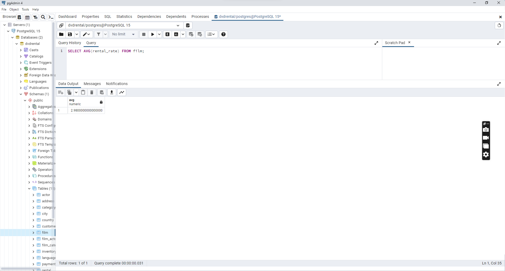

# Aggregate Fonksiyonlar - MIN, MAX, SUM, AVG
Aggregate fonksiyonları yardımıyla bizler veri kümelerimizden sonuçlar çıkarabiliriz. Ne demek istiyorum? Şu senaryoları düşünelim.

- Toplam kaç adet müşterimiz var?
- Elimizde bulunan filmlerin ortalama uzunluğu nedir?
Bu şekilde belirli veri kümelerinden tek bir sonuç çıkarmak için aggregate fonksiyonları kullanırız.

## Örnek Kullanımlar
AVG fonksiyonunu kullandığımız sayısal değerlerden oluşan sütunun ortalama değerini alırız.
```
SELECT AVG(length)
FROM film;
```
sorgusu sayesinde film tablosunda bulunan length sütunundaki değerlerin ortalamasını alırız. SUM fonksiyonunu kullandığımız sayısal değerlerden oluşan sütunun toplam değerini alırız.

```
SELECT SUM(length)
FROM film;
```
sorgusu sayesinde film tablosunda bulunan length sütunundaki değerlerin toplamını alırız. MAX fonksiyonunu kullandığımız sayısal değerlerden oluşan sütunun en yüksek değerini alırız.

```
SELECT MAX(length)
FROM film;
```
sorgusu sayesinde film tablosunda bulunan length sütunundaki değerlerin en yüksek değerini alırız. MIN fonksiyonunu kullandığımız sayısal değerlerden oluşan sütunun en düşük değerini alırız.

```
SELECT MIN(length)
FROM film;
```
sorgusu sayesinde film tablosunda bulunan length sütunundaki değerlerin en düşük değerini alırız

[film tablosunda bulunan rental_rate sütunundaki değerlerin ortalaması nedir?](png/1.png)



[film tablosunda bulunan filmlerden kaç tanesi 'C' karakteri ile başlar?](png/2.png)


[film tablosunda bulunan filmlerden rental_rate değeri 0.99 a eşit olan en uzun (length) film kaç dakikadır?](png/3.png)


[film tablosunda bulunan filmlerin uzunluğu 150 dakikadan büyük olanlarına ait kaç farklı replacement_cost değeri vardır?](png/4.png)

